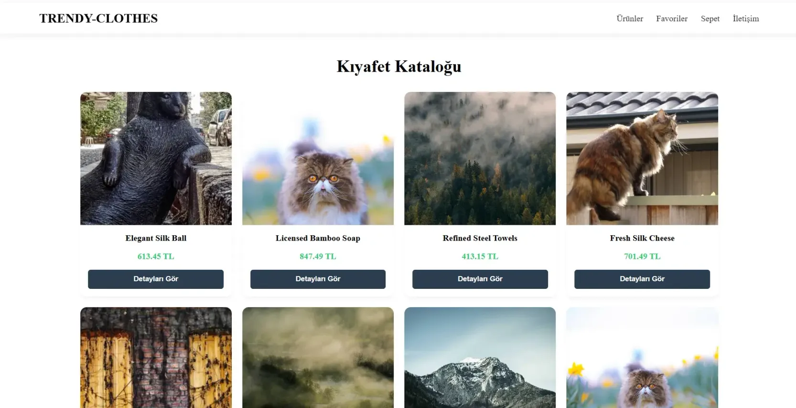

# e-commerce-app

React • Vite • Styled Components • React Router • Axios • Context API • Mockapi App

---

[See The Project](https://akecommerceapp.netlify.app/)

---



---

Bu proje, modern bir alışveriş deneyimi sunan, kullanıcıların kıyafetleri inceleyebileceği, detaylarına bakabileceği, sepetine ve favorilerine ürün ekleyebileceği dinamik bir **E-ticaret** uygulamasıdır. Veriler **Mockapi.io** üzerinden çekilmektedir.

### 🚀 Özellikler

- **Dinamik Ürün Kataloğu:** Mockapi.io üzerinden Axios kullanılarak çekilen gerçek zamanlı verilerle ürün listeleme.
- **Detaylı Ürün Sayfası:** Her ürün için özel detay sayfası, açıklama ve fiyat bilgisi.
- **Sepet ve Favori Yönetimi:** Context API kullanılarak uygulama genelinde yönetilen gelişmiş sepet ve favori sistemi.
- **Responsive Tasarım:** Tüm cihazlarda (Mobil, Tablet, Masaüstü) kusursuz çalışan esnek arayüz.
- **URL Senkronizasyonu:** React Router ile sayfalar arası geçiş ve dinamik rotalama (Anasayfa, Detay, Sepet, Favoriler, İletişim).
- **Modern Butonlar:** `Styled Components` kullanılarak geliştirilmiş, etkileşimli ve estetik buton tasarımları.

### 🛠️ Teknoloji Yığını

- **Frontend:** React 18+ (Vite)
- **Styling:** Styled Components
- **API Katmanı:** Axios & Mockapi.io
- **Yönlendirme:** React Router DOM
- **Durum Yönetimi:** Context API (Global State)
- **Hooks:** useState, useEffect, useContext, useParams

### 📋 Gereksinimler

- Node.js (v18+)
- npm veya yarn

### 🔧 Kurulum ve Çalıştırma

```bash
git clone https://github.com/kullaniciadi/proje-adiniz.git
cd proje-adiniz
yarn install
yarn dev
```

---

[Frontend Web Development Projeleri](https://academy.patika.dev/courses/frontend-web-development-projeleri/e-commerce)

[Patika](https://academy.patika.dev/tr/@alpk)
